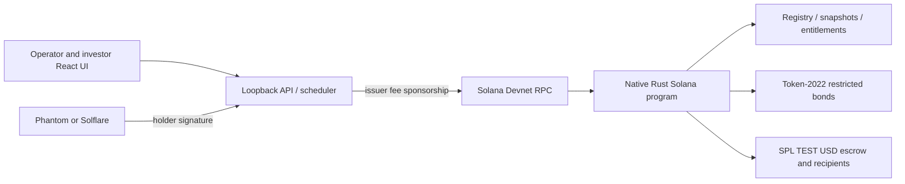

# KASE Flow v2 — technical overview

## Workspace release

Multiple Devnet issues, custom issuance terms, versioned drafts, manual operator admissions and local approval, scoped API requests, per-issue automation, forecast/preview and closure reporting are implemented. See [WORKSPACE.md](WORKSPACE.md) for persistence, routing and recovery boundaries. This adds no new on-chain instruction or production multi-user role model.

## Architecture



The SBF program is deployed to Devnet at `4r48EMFeGkNMyrhEvoZgkmQJrdW9VjaatRpH9y677nq1`. Devnet is the only supported runtime. Configuration, issuer keys and journals live in `.local/devnet/`. All writes verify the expected Devnet genesis hash; Mainnet is not supported.

The state account is keypair-created, program-owned, initialized atomically with account creation and cannot be reinitialized. A PDA derived from `vault + state address` controls the bond mint and settlement vault. The closed registry has at most 16 unique wallets and supports 16 corporate actions. Display names are off-chain labels, not KYC.

## Bond tokens and record dates

Bonds are Token-2022 tokens with zero decimals and a PermanentDelegate extension. The program PDA is mint authority, freeze authority and permanent delegate. `AttachTokens` validates those authorities, an initially empty mint, extension set, each holder account and the cash vault. It mints the registry supply and freezes all bond accounts. It can run only once and only before any lifecycle action. No further issuance instruction is exposed.

Each transfer requires the source holder's signature. The program checks both token accounts against the registry, thaws them, transfers through Token-2022, freezes them again and updates registry balances in the same atomic transaction. Direct token transfers, burns, owner changes and thaw attempts are rejected. Consequently the registry cannot be bypassed with wallet transfers.

`Schedule` commits a future-or-current record timestamp. From that timestamp, program-mediated transfers are blocked even before `Snapshot` runs. A delayed snapshot therefore reads balances frozen since the cutoff. It stores the actual execution slot, never an invented historical slot. Transfers stay blocked until the action completes; maturity independently blocks transfers. The prototype does not reconstruct arbitrary historical balances.

## Entitlements

All amounts use integer micro-units of TEST USD (six decimals). Checked `u128` intermediates avoid float rounding and detect overflow. Rates are basis points.

```
coupon = floor(units_at_record * face_micro * annual_coupon_bps / (10000 * frequency))
partial_units = floor(units_at_record * redemption_bps / 10000)
partial_principal = partial_units * face_micro
final_principal = units_at_record * face_micro
```

Ten bonds, face 1,000 TEST USD, annual rate 10%, frequency two: 500 TEST USD per coupon. Later coupons use remaining units after partial redemption. Fractional bond residuals remain outstanding. Full-period coupons are assumed; no day-count, accrued-interest compensation, withholding tax, FX or ex-coupon pricing is implemented. The compressed demo schedule does not prorate coupon amounts.

## Settlement and atomic redemption

`Scheduled → Snapshot → Initiated → Partially paid → Completed`.

`Confirm(holder)` now executes actual token settlement for tokenized instruments. Either the issuer or that holder may sign. The recipient's mint and owner, canonical stored vault, token programs and bond balances are verified on-chain. SPL `transfer_checked` moves TEST USD from the PDA vault to the holder. For redemption, the program thaws and burns the holder's Token-2022 units using the permanent delegate, then refreezes the account. Transfer, burn, registry updates and receipt flag commit together or all fail. Insufficient escrow cannot retire bonds or mark an entitlement paid.

Each row is payable once; completed coupon periods cannot repeat. Final redemption requires all coupon periods, including the final one. Partial actions reserve capacity for remaining coupons and final redemption. Mint supply and registry supply agree after issuance, transfers and redemptions.

TEST USD is an unbacked SPL test token with an issuer-controlled mint. Demo funding mints it into the vault. This demonstrates token settlement, not fiat movement, USDC backing or a banking integration. There is no vault withdrawal instruction; overfunded residuals remain locked in this prototype.


## Wallets and automation

The investor UI integrates injected Phantom/Solflare providers. A newly connected address can be included as the final holder of a new issue; its private key is never sent to the server. Claims use a server-built transaction partially signed by the fee-paying test issuer and then signed by the holder in the wallet. Submission checks exact message equality, all signatures, the selected instrument and action, and a 120-second proposal expiry. Callers cannot submit arbitrary instructions for sponsorship. On-chain authorization and paid flags remain the final guards.

The optional scheduler polls and executes one step at a time under the same API write lock as manual actions. It reads chain status before retrying, skips settled rows, checks escrow funds and preserves its enabled/error state on disk. It schedules due coupons and final redemption; operators schedule optional partial redemption. Restarting the API resumes from chain state. An ambiguous timeout may cause a rejected retry but cannot cause a duplicate payout. The journal is an index, not the settlement authority.

Devnet reads batch token accounts, coalesce simultaneous state requests and cache responses for up to eight seconds. Mutation responses invalidate the cache. Scheduling reserves 30 seconds for RPC/confirmation latency. These are demo operational controls, not a production job queue or distributed lock.

## Runtime and verification

All clock reads, account state and transaction receipts come from public Solana Devnet RPC. There is no local validator, emulation adapter, manual clock or alternate network mode. The application stores only signing profiles and a journal index; Solana accounts remain authoritative.

Devnet transactions and token accounts can be checked independently in Solana Explorer using `?cluster=devnet`. The deployment script keeps the upgrade authority in the test issuer wallet; no claim of immutability or external audit is made.

The security suite covers unauthorized instructions, direct token bypass attempts, wrong recipients, empty escrow, duplicate claims, exact coupon arithmetic, actual holder signatures, partial/final burn, the complete browser lifecycle, automated continuation and mobile layout. The browser wallet test uses an explicitly injected test provider and real ed25519 signatures; an installed real wallet extension remains an interactive integration test.

## Boundaries

Loopback-only trusted-workstation prototype. No production authentication, role separation, multisig, external KMS, licensed market data, KASE/bank/KYC integration, cancellation, recovery or regulated custody. The mint/freeze/permanent-delegate powers and upgrade authority are central trust assumptions and must be independently reviewed before real use.

Primary implementation references: [Solana token basics](https://solana.com/docs/tokens/basics), [Token-2022 source](https://github.com/solana-program/token-2022), [Phantom integration](https://docs.phantom.com/solana/integrating-phantom).
